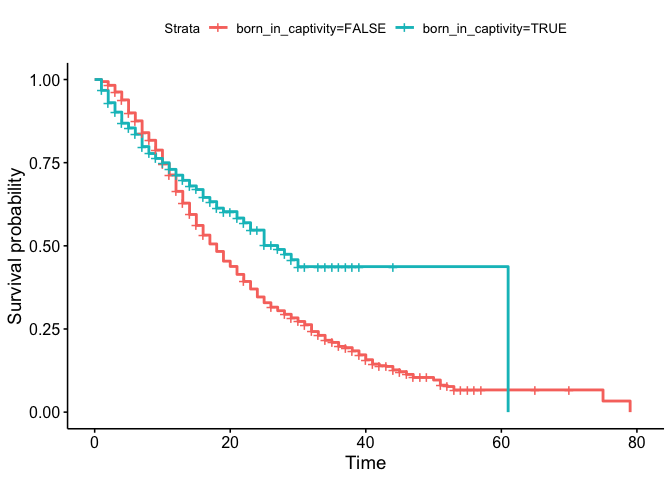

<!-- README.md is generated from README.Rmd. Please edit that file -->

# cetaceans 🐬 🐳

<!-- badges: start -->
<!-- badges: end -->

This data package contains a data set of cetaceans living in captivity
in the USA, derived from a [Tidy Tuesday data
set](https://github.com/rfordatascience/tidytuesday/tree/master/data/2018/2018-12-18).

## Installation

You can install the development version of cetaceans from
[GitHub](https://github.com/) with:

``` r
# install.packages("pak")
pak::pak("hfrick/cetaceans")
```

## Example

``` r
library(cetaceans)
library(survival)
library(survminer)
#> Loading required package: ggplot2
#> Loading required package: ggpubr
#> 
#> Attaching package: 'survminer'
#> The following object is masked from 'package:survival':
#> 
#>     myeloma

data("cetaceans")
survfit(Surv(age, event) ~ born_in_captivity, data = cetaceans) %>% 
  ggsurvplot()
```


